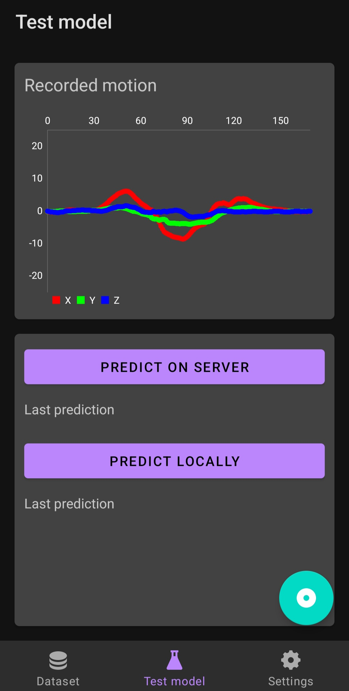

<h1> Android Motion Recorder </h1>

An Android application intended for collecting accelerometer's readings. Its main purpose is to record 'motion gestures' and send them to a server in order to build a dataset. These readings are further processed and used to train neural network models, recognizing specific gestures as commands.

The application was written in Java, on API level 28 (Android 9).

Code for the server receiving the data can be found at [aleksgorecki/motion-server](https://github.com/aleksgorecki/motion-server).

# Table of Contents
- [Table of Contents](#table-of-contents)
  - [Main functionalities](#main-functionalities)
    - [Recording 'gestures'](#recording-gestures)
    - [Creating datasets](#creating-datasets)
    - [Making predictions](#making-predictions)
    - [Customizing application's settings](#customizing-applications-settings)
  - [Additional screenshots](#additional-screenshots)
  - [Earlier versions](#earlier-versions)
  - [Dependencies](#dependencies)

## Main functionalities

### Recording 'gestures'

A floating action button (FAB) can be pressed to start recording the next 800 milliseconds of accelerometer's readings. Alternatively, the volume-down side button may also be pressed to trigger this state. After it finishes, the recorded gesture is held in memory and displayed on a 2D chart in the upper half of the screen. The gesture can be then sent to the server or classified locally.

### Creating datasets

In the dataset view, the lower half of the screen is used for labeling the recording and sending it to the server. Dataset name and gesture class represent the directories, in which the recording will be stored (inside server files).

  

### Making predictions

In the test model view, the recording may be classified in order to test the classifying model or the quality of the recording. Predictions may be performed locally, using the default model shipped with the application or by sending it to the server and using the model currently loaded there. The result is displayed in a 'pop-up' dialogs.

  

### Customizing application's settings

The settings view provides a scrollable list of preferences. These are the following:

- server's address
- the duration before the connection times out
- recording duration
- enabling a countdown before the recording starts (and its exact time)
- minimal and maximial signal amplitude value to be used when cropping the recordin

  

## Additional screenshots

Local prediction result displayed in a 'pop-up' dialog: 

  

Additional countdown starts after the record button was pressed and the recording starts only after the countdown is finished:

  

The UI was built using fragments and the application may be also used in landscape mode (although it's not recommended since turning the phone changes the axes, which may lead to confusion while analyzing the data):

  

## Earlier versions

The project was initially started as a tool for recording and sending the data. At that moment, the application consisted of one activity hosting all of the UI elements:

  

As the idea of recognizing these 'motion gestures' turned out to be possible, the application was extended.

## Dependencies
- MpAndroidChart
- OkHttp
- Tensorflow Lite
- androidx Navigation